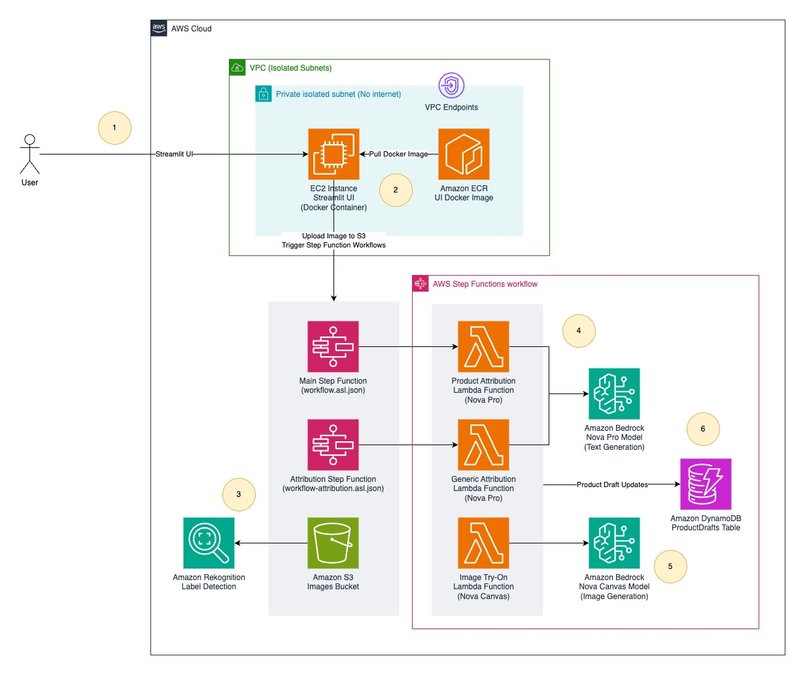

# AI-Powered Product Catalog Revolution: From Photos to Rich Listings

This sample project demonstrates an AI-powered solution that transforms simple product photos into rich, detailed product listings using Amazon Bedrock's foundation models. The system automatically generates product descriptions, creates virtual try-on images, and provides comprehensive product attribution.

## Architecture Overview



The architecture diagram illustrates the following processing workflow:

1. **User Interaction**: Users access the Streamlit web application running on EC2 to upload product images and configure generation parameters (gender, pose, body structure, emotion, brand voice, etc.)

2. **Image Upload & Storage**: Product images and optional human model images are uploaded and stored in Amazon S3 buckets for processing

3. **Workflow Orchestration**: AWS Step Functions initiates and orchestrates the AI processing workflow, managing the sequence of operations and error handling

4. **Product Attribution**: The first Lambda function (`product-attribution`) analyzes the uploaded product image using Amazon Bedrock's Nova Pro model to:
   - Extract product features and attributes
   - Generate detailed product descriptions
   - Apply brand voice and pricing influences based on user parameters

5. **Virtual Try-On Generation**: The second Lambda function (`image-try-on`) leverages Amazon Bedrock's Nova Canvas model to:
   - Generate or use the provided human model image
   - Apply the product to the human model based on specified parameters (pose, body structure, emotion)
   - Create realistic virtual try-on images

6. **Data Persistence**: Product information, metadata, and processing status are stored in Amazon DynamoDB for tracking and retrieval

7. **Output Storage**: Generated images (virtual try-on results) and product descriptions are stored back in Amazon S3

8. **Results Display**: Users can view the generated content through the Streamlit interface, accessing both the AI-generated product descriptions and virtual try-on images

## Features

- **Product Image Upload**: Upload product photos for AI analysis
- **Virtual Try-On**: Generate realistic images of products on human models
- **Customizable Parameters**: Configure gender, pose, body structure, emotion, brand voice, and pricing influences
- **AI-Generated Descriptions**: Automatic product attribution and description generation from any set of photos. Example use cases below:
    - Generate hotel room listing from pictures of Room.
- **Secure Deployment**: VPC-isolated EC2 instance with SSM access

## Prerequisites

Before deploying this solution, ensure you have:

1. **AWS CLI** configured with appropriate permissions
2. **AWS CDK** installed (`npm install -g aws-cdk`)
3. **Node.js** (version 18 or later)
4. **Docker** installed and running
5. **jq** command-line JSON processor (Optional only for local development)
6. **AWS Account** to deploy this sample project

### Enable Amazon Bedrock Models

Before deployment, you must enable the required foundation models in Amazon Bedrock:

1. Navigate to the Amazon Bedrock console
2. Go to "Model access" in the left navigation
3. Request access to:
   - **Amazon Nova Pro** (`amazon.nova-pro-v1:0`) - for text generation
   - **Amazon Nova Canvas** (`amazon.nova-canvas-v1:0`) - for image generation

## Deployment Instructions

### 1. Clone and Setup

```bash
git clone https://github.com/aws-samples/sample-ai-powered-product-catalog.git
cd sample-ai-powered-product-catalog
npm install
```

### 2. Bootstrap CDK (if not already done)

```bash
cdk bootstrap
```

### 3. Deploy the Stack

```bash
cdk deploy AutomatedProductCatalogStack
```

The deployment will create:
- All AWS infrastructure components
- A containerized Streamlit application running on EC2
- VPC with appropriate security groups and endpoints

## Accessing the Application

### Using UI from EC2 via System manager Port forwarding

The EC2 instance is deployed in a private isolated subnet without internet access. Use AWS Systems Manager Session Manager to create a secure tunnel:

1. **Start SSM Port Forwarding Session**:
   ```bash
   # Get the EC2 instance ID from the AWS Console or CLI
   INSTANCE_ID=$(aws ec2 describe-instances \
     --filters "Name=tag:aws:cloudformation:stack-name,Values=AutomatedProductCatalogStack" \
               "Name=instance-state-name,Values=running" \
     --query 'Reservations[0].Instances[0].InstanceId' \
     --output text)
   
   # Create port forwarding session
   aws ssm start-session \
     --target $INSTANCE_ID \
     --document-name AWS-StartPortForwardingSession \
     --parameters '{"portNumber":["8501"],"localPortNumber":["8501"]}'
   ```

2. **Access the Application**:
   Open your browser and navigate to: `http://localhost:8501`

3. **Stop the Session**:
   Press `Ctrl+C` in the terminal where the SSM session is running

### Developing locally or running UI locally

For development and testing, you can run the Streamlit application locally:

1. **Navigate to the UI directory**:
   ```bash
   cd ui
   ```

2. **Install Python dependencies**:
   ```bash
   pip install -r requirements.txt
   ```

3. **Run the local development script**:
   ```bash
   chmod +x start-local.sh
   ./start-local.sh
   ```

   This script will:
   - Set the AWS region to `us-east-1`
   - Fetch CloudFormation stack outputs and set them as environment variables
   - Start the Streamlit application locally

4. **Access the Application**:
   The script will display a local URL (typically `http://localhost:8501`)

## Using the Application

1. **Upload Product Image**: Select a product photo (JPG, JPEG, or PNG)
2. **Optional Human Model**: Upload a human model image, or let AI generate one
3. **Configure Parameters**:
   - **Gender**: male, female, or unisex
   - **Pose**: Straight, Hand raised, or Looking aside
   - **Body Structure**: Average (Build A), Oversize (Build B), or Thin (Build C)
   - **Emotion**: Confident, Amazed, or Funny
   - **Brand Strength**: Fabric, Style, Design, or Competitive Pricing
   - **Brand Voice**: Budget, Fun, or Trustworthy
   - **Pricing Influence**: Inventory Level, Fabric, or Weather
   - **Promoted Product**: Toggle for promotional treatment
   - **Number of Output Images**: 1-5 generated images

4. **Submit**: Click Submit to start the AI processing workflow
5. **View Results**: Navigate to the outputs page to see generated images and product descriptions

## Cleanup

To avoid ongoing AWS charges, destroy the stack when no longer needed:

```bash
cdk destroy AutomatedProductCatalogStack
```

## Costs
Running this sample for processing 1000 images per month costs about 170$ to 290$ in us-east-1 region.
- Amazon Bedrock - Amazon Nova Canvas for AI generated human images 3 x 1000 = 3000 x 0.04 = 120$ (This applies only when not using actual huamn model images)
- Amazon Bedrock - Amazon Nova Canvas for Virtual tryon images 3 x 1000 = 3000 x 0.04 = 120$
- Amazon Bedrock - Amazon Nova Pro for Attribution 
- Amazon EC2 36$
- Amazon DynamoDB 3$
- AWS Step function 0.5$
- Amazon S3 1$ (15g storage)
- AWS Lambda 1$

## License

This library is licensed under the MIT-0 License. See the LICENSE file.

## Contributing

See [CONTRIBUTING](CONTRIBUTING.md) for more information on how to contribute to this project.

## Security

See [CONTRIBUTING](CONTRIBUTING.md#security-issue-notifications) for more information about reporting security issues.
